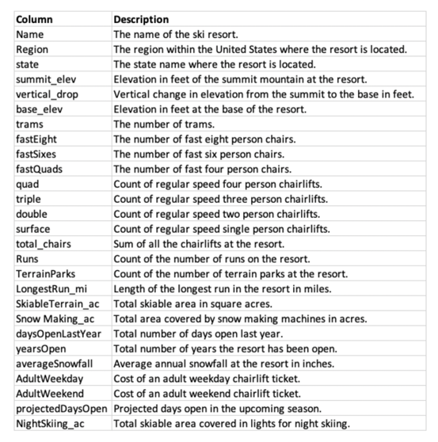

#### Geo - state, region
#### terrain
  - elevation (summit elevation, base elevation)
  - vertical drop
  - average snowfall
#### facility
  - snow-makers per acre
  - night skiable area covered with lights
  - total skiable area
  - number of parks
  - trams
  - lifts
    - fasts, regulars, capacity
  - runs
    - count
    - longest
#### business
  - days open last year
  - projected days open
  - years open
  - 
#### pricing
  - adult weekday
  - adult weekend
  - 

